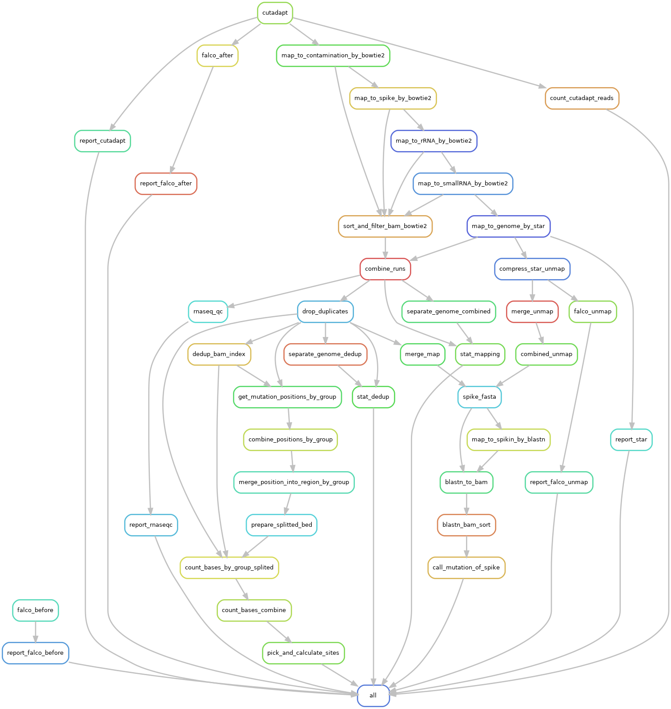

<!-- prettier-ignore-start -->
# Dissect the pipeline
{: .fs-9 }
<!-- prettier-ignore-end -->

Design and Technical Concern of Pipeline
{: .fs-6 .fw-300 }

## Aligiment parameters

## Mutatin calling

## m6A sites filtering
