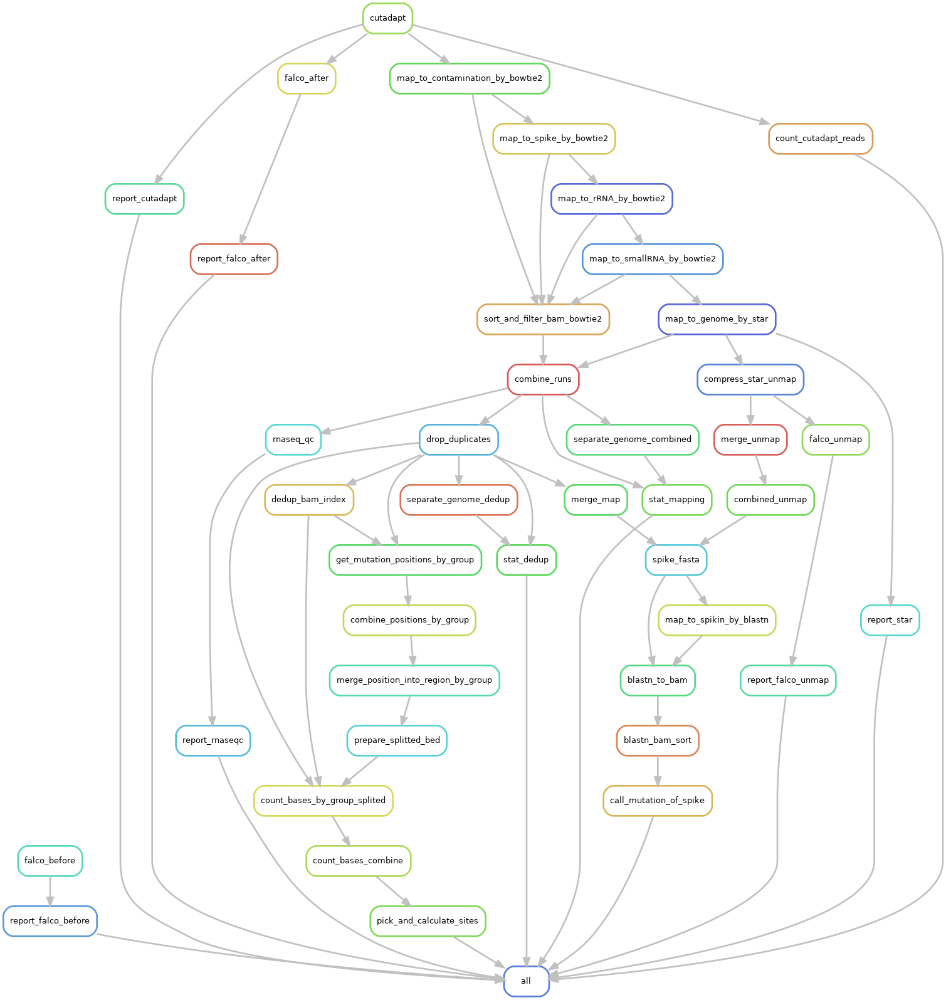

<!-- prettier-ignore-start -->
# m6A-SAC-seq
{: .fs-9 }
<!-- prettier-ignore-end -->

A Method for Assaying m6A Epigenetic Modifications at Single Base Resolution
{: .fs-6 .fw-300 }

[Get started now](Run-the-pipeline){: .btn .btn-primary .fs-5 .mb-4 .mb-md-0 .mr-2 } [View it on GitHub](https://github.com/y9c/m6A-sacseq){: .btn .fs-5 .mb-4 .mb-md-0 }

## Table of Content

[Overall-Workflow](Overall-Workflow)

[Run-the-pipeline](Run-the-pipeline)

[Dissect-the-pipeline](Dissect-the-pipeline)

## Overall Workflow

### Quality control:

We will first perform read trimming to remove adapters, primer sequences, molecular barcode (UMI), and low-quality bases using the `cutadapt` software.

### Data Processing:

All trimmed reads will be mapped to E. coli and Mycoplasma genome to filter biological contamination RNA using the `bowtie2` tool, and then unmapped reads will be mapped to spike-in sequence to filter RNA spike-in.
Similarly, unmapped reads will be mapped to the ribosomal RNA, small RNA and mRNA (whole genome) reference sequence sequentially.
After mapping, reads with identical UMI and mapped to the same location will be treated as PCR duplicates and dropped from downstream analysis.

### m6A Analyses:

m6A sites (mutation signal) were detected simultaneously, and mutation number and sequencing depth for each mutation position among all the samples were recorded.
Then putative m6A sites will be detected based on the mutation ratio, mutation number, and sequencing depth of each mutation position.
